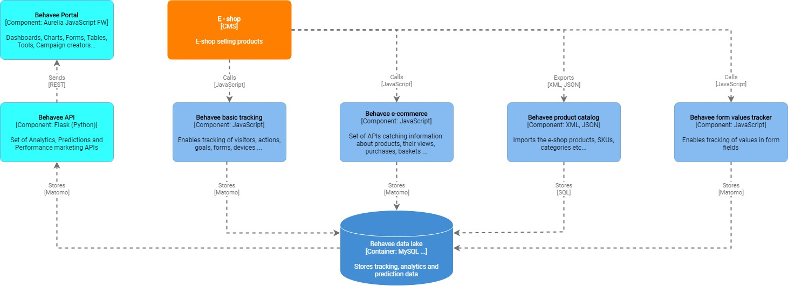

# Ecommerce tracking #

`addEcommerceItem(productSKU, productName, productCategory, price, quantity)`
1. This adds a product into the order, and must be called for each product in the order. 
1. ProductSKU is a required parameter, it is also recommended that you send other parameters if they are applicable in your Ecommerce shop.

`trackEcommerceOrder(orderId, grandTotal, subTotal, tax, shipping, discount)` 
1. This tracks an Ecommerce order and sends the data to your Matomo (Piwik) server, for both this order and products previously added. 
1. Only orderId and grandTotal (ie. revenue) are required.

## Add product to the order ##
```
_paq.push(['addEcommerceItem',
    "40fb5406", // (required) SKU: Product unique identifier
    "40″ Thomson 40FB5406", // (optional) Product name
    ["Electronics","TV", "Smart TV"], // (optional) Product category. You can also specify an array of up to 5 categories eg. ["Books", "New releases", "Biography"]
    7777.00, // (recommended) Product price
    1 // (optional, default to 1) Product quantity
]);
// Here it is important to add all other products found in the cart, even the products not updated by the current "Add to cart" click
[...]

_paq.push(['trackEcommerceCartUpdate','12990.00']) // update cart to track abandoned carts
// recomended to call trackPageView, mostly on onepager to clear expired items from cart in the next trackEcommerceCartUpdate event 
_paq.push(['trackPageView']);
```

## Specify the order details to Behavee server &amp; sends the data to Behavee server ##
```
// as in adding items to cart, call function addEcommerceItem to add items into order 
_paq.push(['addEcommerceItem',
    "40fb5406", // (required) SKU: Product unique identifier
    "40″ Thomson 40FB5406", // (optional) Product name
    ["Electronics","TV", "Smart TV"], // (optional) Product category. You can also specify an array of up to 5 categories eg. ["Books", "New releases", "Biography"]
    7777.00, // (recommended) Product price
    1 // (optional, default to 1) Product quantity
]);
// Here it is important to add all other products found in the cart, even the products not updated by the current "Add to cart" click
[...]

_paq.push(['trackEcommerceOrder',
    "201800001", // (required) Unique Order ID
    7977.00, // (required) Order Revenue grand total (includes tax, shipping, and subtracted discount)
    7777.00, // (optional) Order sub total (excludes shipping)
    800.00, // (optional) Tax amount
    200.00, // (optional) Shipping amount
    false // (optional) Discount offered (set to false for unspecified parameter)
]);
// we recommend to leave the call to trackPageView() on the Order confirmation page
_paq.push(['trackPageView']);
```

## Tracking a Product Page View ##
- all parameters are optional, but we recommend to set at minimum productSKU and productName
- following code is added to the Product page for the product 50″ Samsung UE50MU6192 which is in the 
  categories "Electronics","TV","Smart TV","Samsung Giant TV":

```
_paq.push(['setEcommerceView',
    "50mu6192", // (required) SKU: Product unique identifier
    "50″ Samsung UE50MU6192", // (optional) Product name
    ["Electronics","TV","Smart TV","Samsung Giant TV"], // (optional) Product category, or array of up to 5 categories
    16490.00 // (optional) Product Price as displayed on the page
]);
```

## Tracking a Category page view ##
- this code is added on the Category page "Ultrabooks”
- on a category page, productSKU and productName are not applicable and are set to false

```
_paq.push(['setEcommerceView',
    productSku = false, // No product on Category page
    productName = false, // No product on Category page
    category = "Ultrabooks" // Category Page, or array of up to 5 categories e.g. ["Notebooks","Ultrabooks"]
]);
```

## Get visitorid with javascript ##
```
var visitor_id;
_paq.push([ function() { visitor_id = this.getVisitorId(); }]);
```

## Vizualization

