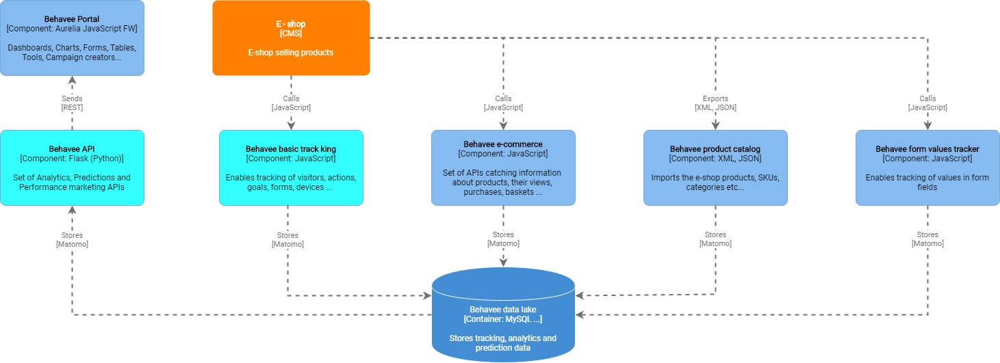

Following document describes the process and components needed for integration of Behavee with any e-commerce solution. Behavee for e-commerce, provides multiple levels of integration according to Partner (subject having the e-commerce solution) needs.
For getting of all Behavee benefits including sales statistics, product attractivity calculations, channel performance and ability to increase revenue and conversions, all Behavee components must be integrated.
Picture below depicts what components need to be integrated.

